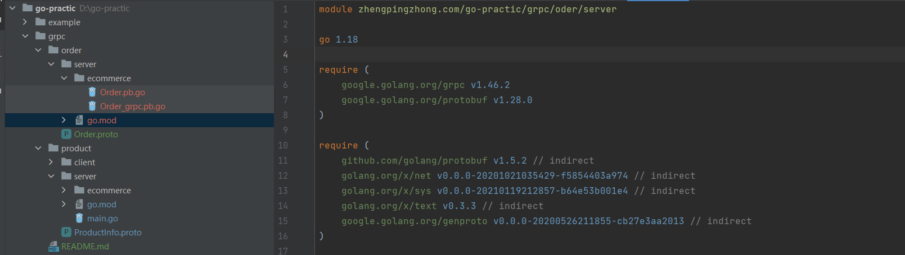

# 简介
该项目主要基于《gRPC与云原生应用开发》一书一中的示例进行学习，主要针对libprotoc 3.20.1 做了部分修正

## protoc
* 下载地址 [https://github.com/protocolbuffers/protobuf/releases](https://github.com/protocolbuffers/protobuf/releases)
* 文档地址 [https://developers.google.com/protocol-buffers/docs/gotutorial](https://developers.google.com/protocol-buffers/docs/gotutorial)

## 生成骨架代码
* protoc

protoc --go_out=. ./Order.proto
* protoc gRPC

protoc --go-grpc_out=. ./Order.proto

## 导入包
```
cd  D:\go-practic\grpc\order\server\
go mod init zhengpingzhong.com/go-practic/grpc/oder/server
go mod tidy
```

## 代码目录结构及依赖
